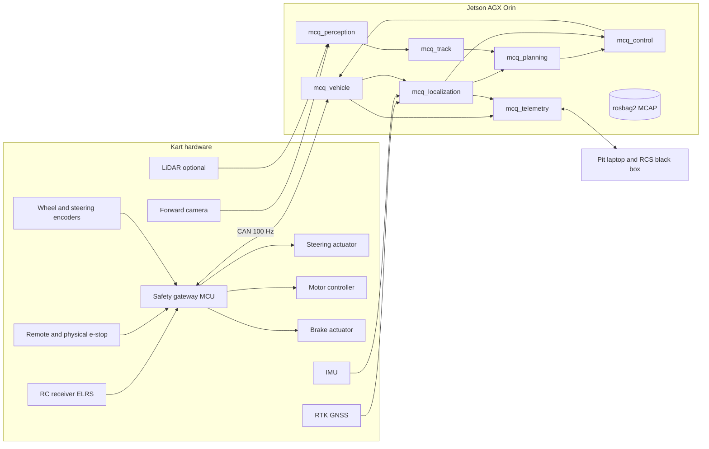

# Architecture: the program

2026-09-12: the control math of section 8 (PID, bicycle model, pure pursuit, curvature and rate limits, longitudinal state machine, speed profile) lives in `src/mcq_control/core` as a dependency-free C library that the ROS 2 node wraps and the simulator loads through ctypes. The planner of section 7.2 exists as a Python prototype in `mcq_sim` and is ported to C once its behavior settles; it samples two maneuver lengths (half and full horizon) per lateral offset, which the first draft of 7.2 did not mention. Message definitions of section 5 are in `src/mcq_msgs` with two additions, `GatewayStatus` and `GeofenceState`, and the CAN layout is in `src/mcq_vehicle/dbc/mcqueen.dbc`. The high-rate topics (`VehicleState`, `GatewayStatus`, `EgoState`, `VehicleCommand`, `Trajectory`, IMU) use best-effort, keep-last QoS on both ends: a reliable subscriber that falls behind (the recorder, the pit link) would otherwise block publishers for up to the DDS blocking time, and the CI graph stalled exactly that way once recording was added. Freshness is enforced by the age checks, not by delivery guarantees. One measured hazard: when a new participant joins the DDS graph mid-run (a tool from the pit, a late recorder), the rclpy nodes freeze for 200 to 350 ms while the C++ nodes do not, and the controller's 200 ms trajectory-age check then requests an urgent stop, correctly. Until the planner is ported to C++, every pit-side tool joins the graph before `AUTO` is entered, and the CI graph test starts its observers before the nodes for the same reason.

This is the outline of the software as it should exist at the end of the first season. Package names match the repository layout in the README. Units are SI throughout; angles are radians; frames follow ROS REP 103 (x forward, y left, z up) and REP 105 (`map`, `odom`, `base_link`).

## 1. Runtime overview



Two physical computers matter. The gateway microcontroller owns the actuators and the safety state machine (see the safety document). The Jetson owns everything that decides where to go. The Jetson can request an urgent stop; it can never prevent one.

## 2. Operating modes

The gateway is the authority on mode. The Jetson reports what it wants and reads back what it got.

| Mode | Who drives | Entry | Exit |
| --- | --- | --- | --- |
| `INIT` | Nobody; actuators disabled | Power on | Self-test passes |
| `RC` | Human on the transmitter through the gateway | Default after `INIT`; any fault from `AUTO` | Transmitter switch to `AUTO` with heartbeat healthy and speed below the handover limit |
| `AUTO` | Jetson trajectory through `mcq_control` | From `RC` only | Transmitter switch, heartbeat loss, RC link loss, remote e-stop, Jetson-requested urgent stop, gateway limit violation |
| `URGENT_STOP` | Gateway alone: throttle zero, brakes on, steering held | Any trigger above | Standstill and operator reset from the transmitter |
| `DRIVETRAIN_OFF` | Nobody; contactor open | Remote e-stop, or timeout in `URGENT_STOP` | Manual reset |

Within `AUTO`, the Jetson has two sub-modes chosen by parameter and reported in telemetry: `FOLLOW` (reference is the surveyed raceline or centerline) and `BOUNDARY` (reference is built live from perceived boundaries, with a lower speed cap).

## 3. Coordinate frames

| Frame | Definition | Published by |
| --- | --- | --- |
| `map` | East-north-up local tangent plane anchored at a fixed datum per track (stored in the track file); z up | `mcq_localization` |
| `odom` | Continuous, drift-prone frame from IMU and wheel integration; used only when GNSS is lost | `mcq_localization` |
| `base_link` | Rear axle center, on the ground plane | static, from `mcq_bringup` URDF |
| `gnss_antenna`, `imu_link`, `camera_front`, `lidar_link`, `steering_column` | Sensor mounts measured on the kart | static, from URDF |

Track files store coordinates in `map`. Perception publishes in `base_link`; the track node transforms them into `map` using the latest pose.

## 4. Processes, rates and languages

| Node (package) | Language | Rate | Reads | Writes |
| --- | --- | --- | --- | --- |
| `gateway_bridge` (`mcq_vehicle`) | C++ | 100 Hz | CAN frames from the gateway; `VehicleCommand` | `VehicleState`, `GatewayStatus`; CAN frames to the gateway with heartbeat counter |
| `gnss_driver` (`ublox_dgnss`) | C++ | 20 Hz fix, RTCM in | USB, RTCM from NTRIP client or RCS black box | `NavPVT`, fix, covariance |
| `imu_driver` | C++ | 200 to 400 Hz | Sensor bus | `sensor_msgs/Imu` |
| `state_estimator` (`mcq_localization`) | C++ | 100 Hz, IMU-driven predict | GNSS, IMU, `VehicleState` (wheel speeds, steering angle) | `EgoState` (pose, velocity, yaw rate, slip estimate, covariance, GNSS status), `map` to `base_link` TF |
| `track_server` (`mcq_track`) | C++ | On change plus 10 Hz | Track file, raceline file, `TrackBounds` from perception, `EgoState` | `TrackModel` (centerline, widths, raceline, Frenet lookup), `GeofenceState` |
| `boundary_detector` (`mcq_perception`) | C++ with CUDA/TensorRT | 20 to 30 Hz | Camera image; LiDAR cloud if present | `TrackBounds` in `base_link`, `Detections` (other karts) |
| `local_planner` (`mcq_planning`) | C++ | 20 Hz | `EgoState`, `TrackModel`, `Detections`, mode | `Trajectory` (2.5 s horizon, 50 ms samples) |
| `controller` (`mcq_control`) | C++ | 100 Hz | `Trajectory`, `EgoState`, `VehicleState` | `VehicleCommand` |
| `telemetry_bridge` (`mcq_telemetry`) | Python | 10 Hz | Everything | Pit dashboard (foxglove_bridge), RCS black box (CAN/USB) |
| `rosbag2 record` | built in | all | Every topic | MCAP file per session |

`state_estimator`, `track_server`, `local_planner` and `controller` are composable nodes loaded into one container process with intra-process communication. Nothing in the 100 Hz path serializes through DDS.

Timing budget on the Orin at 100 Hz: gateway bridge under 0.5 ms, estimator under 1 ms, controller under 1 ms, leaving 7 ms of slack per tick. The planner has 50 ms per cycle at 20 Hz and must finish in 30 ms. Perception has 40 ms per frame. Missing two consecutive control ticks trips the gateway watchdog (50 ms timeout).

## 5. Message contracts (`mcq_msgs`)

Custom messages exist only where standard ones do not fit. Standard types are used for sensors (`sensor_msgs`), transforms (`tf2`) and diagnostics.

```
VehicleState.msg
  std_msgs/Header header
  float32 steering_angle          # rad at the front wheels, left positive
  float32 steering_rate           # rad/s
  float32[4] wheel_speed          # m/s, fl fr rl rr
  float32 motor_rpm
  float32 motor_current           # A
  float32 motor_power             # W, before the controller (AKS reporting)
  float32 battery_voltage         # V
  float32 brake_pressure          # normalized 0..1 or bar, per actuator
  uint8 mode                      # INIT, RC, AUTO, URGENT_STOP, DRIVETRAIN_OFF
  uint32 fault_flags              # gateway fault bits
  uint16 heartbeat_echo           # last heartbeat counter the gateway accepted

VehicleCommand.msg
  std_msgs/Header header
  float32 steering_angle          # rad, target at the front wheels
  float32 throttle                # 0..1
  float32 brake                   # 0..1
  bool lat_enable
  bool long_enable
  bool request_urgent_stop
  uint16 heartbeat                # increments every tick

EgoState.msg
  std_msgs/Header header          # frame_id = map
  geometry_msgs/Pose pose
  float32 v                       # longitudinal speed, m/s
  float32 v_lat                   # lateral speed, m/s (positive left)
  float32 yaw_rate                # rad/s
  float32 a_long
  float32 a_lat
  float64[36] covariance
  uint8 gnss_status               # NONE, FLOAT, FIXED
  float32 s                       # Frenet arc length along the reference, m
  float32 d                       # Frenet lateral offset, m (positive left)

TrackModel.msg
  std_msgs/Header header          # frame_id = map
  geometry_msgs/Point[] centerline
  float32[] width_left
  float32[] width_right
  geometry_msgs/Point[] raceline  # empty in BOUNDARY mode
  float32[] raceline_kappa
  float32[] raceline_v
  bool closed
  string track_id

TrackBounds.msg
  std_msgs/Header header          # frame_id = base_link
  geometry_msgs/Point[] left
  geometry_msgs/Point[] right
  float32[] left_confidence
  float32[] right_confidence

Trajectory.msg
  std_msgs/Header header          # frame_id = map
  TrajectoryPoint[] points        # t, x, y, yaw, kappa, v, a, s, d
  uint8 reference                 # RACELINE, CENTERLINE, BOUNDARY
  bool stop_requested

Detections.msg
  std_msgs/Header header
  Detection[] objects             # class, pose in map, velocity, bbox, confidence
```

Services: `mcq/urgent_stop` (Trigger), `mcq/load_track` (path), `mcq/set_auto_submode` (FOLLOW or BOUNDARY), `mcq/set_speed_cap` (m/s, cannot exceed the gateway cap).

## 6. Track model and Frenet frame

The track model is one CSV per track, in the TUM format so the optimizer reads it unchanged:

```
# x_m, y_m, w_tr_right_m, w_tr_left_m
```

Points are in `map`, spaced about 1 m, closed loop. A companion YAML holds the datum (latitude, longitude, height), the start/finish line as two points, the track id, and the survey date.

The survey tool (`tools/survey`) produces this file from an MCAP log in which the kart was driven once along the left edge and once along the right edge (or once along the centerline with a known offset), with RTK fixed. It resamples both edges by arc length, builds the centerline as the midpoint, computes half-widths, and smooths with a spline. The same tool ingests the high-resolution scan if that arrives as a georeferenced point cloud, by extracting the pavement edge from height and intensity.

`mcq_track` builds a cumulative arc-length table and a KD-tree over the centerline so any `map` point converts to (s, d) in constant time, and back. The geofence is the polygon between the two edges, inflated by a configurable margin (0.5 m at first). An `EgoState` outside the polygon, or with a position covariance above threshold, sets `GeofenceState.violation`, which the controller turns into an urgent stop request.

## 7. Planning

### 7.1 Global raceline (offline)

`tools/raceline` calls the TUM `global_racetrajectory_optimization` package with our track file and a vehicle parameter file (mass, wheelbase, and a ggv diagram of achievable longitudinal versus lateral acceleration). The minimum-curvature solve is fast and good enough for the first season; the minimum-time solve uses the ggv and produces a velocity profile. Output is a CSV with s, x, y, heading, curvature, target speed and target acceleration, written to `tracks/<id>/raceline_<date>.csv` and loaded by `track_server`.

The ggv is the tunable that turns reliability into lap time. Start at 3 m/s^2 lateral and 2 m/s^2 longitudinal (a 60 s lap needs far less on this track) and raise it as friction is identified from logged laps.

### 7.2 Local planner (online, 20 Hz)

The planner works in the Frenet frame of the current reference. Every cycle it:

1. Reads the ego (s, d, v) and the reference (raceline in `FOLLOW`, live midline in `BOUNDARY`).
2. Generates candidate paths as quintic polynomials in d over a horizon of 2.5 s, with terminal offsets sampled between the left and right boundaries minus the kart half-width and margin.
3. Rejects candidates that leave the boundaries at any sample, or intersect a detected kart.
4. Assigns each survivor a speed profile: v(s) = min(v_raceline(s), sqrt(a_lat_max / |kappa(s)|), speed cap), then a forward pass with a_long_max and a backward pass with braking limit so the profile is reachable.
5. Scores by predicted time along the horizon plus penalties on lateral jerk and on deviation from the reference, and publishes the best as a `Trajectory`.

In `FOLLOW` mode with no obstacles and a good pose the winner is the raceline itself, so the planner adds no error. In `BOUNDARY` mode the reference is the midline of the perceived edges, extended by continuing the last curvature when perception runs out, and the speed cap is a parameter (5 m/s at first).

A stop request (geofence, telemetry, gateway fault) replaces the profile with a braking ramp to zero along the current path.

### 7.3 Learned planner (later)

A policy trained in `mcq_sim` on boundary observations emits the same `Trajectory` message. It is enabled by the sub-mode service and is subject to the same boundary and limit checks in `mcq_control`, so a bad policy causes a stop, not an excursion.

## 8. Control (100 Hz)

The controller consumes the trajectory and the ego state and produces `VehicleCommand`. It is structured like openpilot's `controlsd`: a lateral controller and a longitudinal controller behind a common limit stage, with per-vehicle parameters in YAML.

### 8.1 Lateral

Bring-up uses pure pursuit because it works with almost no tuning: lookahead L = clamp(k_v * v, L_min, L_max), target point on the trajectory at arc distance L, curvature kappa = 2 sin(alpha) / L, steering angle from the bicycle model. Expect kart-scale values around k_v = 0.5 s, L_min = 1.5 m, L_max = 6 m.

The production lateral controller takes the desired curvature from the trajectory at a preview time equal to the measured steering delay, converts it to a steering angle through the ported `VehicleModel` (which accounts for understeer at speed), adds a feedback term on lateral error and heading error in curvature space, and rate-limits the output. This is the `LatControlAngle` pattern from openpilot. If the steering actuator ends up torque-controlled rather than position-controlled, the `LatControlTorque` pattern applies instead: feedforward from desired lateral acceleration, friction compensation, PID in lateral-acceleration space, torque conversion at the end.

An MPC over the bicycle model (acados, 20 to 40 step horizon at 50 ms) replaces the curvature feedback once the dynamics are identified. It slots in behind the same interface.

### 8.2 Longitudinal

Ported from openpilot's `longcontrol.py`: a three-state machine (off, stopping, pid) and a PID on acceleration error with the trajectory's acceleration as feedforward. Output is a signed acceleration command mapped to throttle and brake through the tables measured in the drive-by-wire phase (throttle map: command to motor current or torque request; brake map: command to actuator position or pressure). A deadband prevents throttle and brake from being applied together. Regenerative braking from the motor controller counts toward the command but the mechanical brake is always available, as the AKS rules require.

### 8.3 Limits

Before publishing, the command passes through steering angle, steering rate, lateral acceleration and lateral jerk limits derived from the ported `opendbc/car/lateral.py` helpers, plus a speed cap. These are looser than the road-car values (which are ISO 11270's 3 m/s^2) and are tuned per phase. The gateway enforces its own, harder limits in firmware; the software limits exist so the gateway never has to.

## 9. Localization

An error-state EKF (or the `robot_localization` package during bring-up) with:

| Input | Rate | Used for |
| --- | --- | --- |
| IMU | 200 to 400 Hz | Prediction step; yaw rate and accelerations |
| RTK GNSS position and velocity | 20 Hz | Position and course update; status gates the covariance |
| Wheel speeds | 100 Hz | Longitudinal speed update; slip flag when they disagree with GNSS velocity |
| Steering angle | 100 Hz | Yaw-rate consistency check through the bicycle model |

State: position, velocity, yaw, yaw rate, IMU biases. Yaw is initialized from GNSS course once the kart moves above 1 m/s; a dual-antenna receiver (moving base) removes that requirement later. When RTK drops from fixed to float, the covariance grows accordingly; when it drops to none, the filter dead-reckons in `odom` and the geofence covariance gate stops the kart after the configured budget (10 s at first).

RTCM corrections come from the Indiana INDOT InCORS network over NTRIP during testing (free, statewide) and from the AKS RCS black box at competition. The NTRIP client needs an internet path: LTE modem on the kart, or the pit network relaying corrections.

LiDAR or camera odometry (Isaac ROS cuVSLAM is available on Orin with JetPack 7.2 and Jazzy) is an optional additional input for the `BOUNDARY` mode where no survey exists; it is not required for the first season.

## 10. Perception

Required for `BOUNDARY` mode, for kart detection in multi-kart runs, and as a sanity check on the map in `FOLLOW` mode.

Camera pipeline: rectified forward image at 20 to 30 Hz, a small segmentation network (pavement versus not-pavement, plus kart class) exported from PyTorch to ONNX to TensorRT and run through the DLA or GPU, then edge extraction along image columns, inverse perspective mapping to the ground plane using the calibrated extrinsics, and polyline fitting. Output is `TrackBounds` in `base_link` with per-point confidence. Training data comes from our own practice laps (allowed by the rules) labeled semi-automatically by projecting the surveyed edges into the images. The AKS `GoKartSampleSet` repository provides kart images for the detector class.

LiDAR pipeline (if the Mid-360 is fitted): ground-plane fit, curb or grass edge from height and intensity discontinuities, same polyline output. LiDAR is the more reliable edge source in low sun and at night; the camera is cheaper and lighter.

`track_server` fuses perceived boundaries into the map as a running estimate keyed by s; in `FOLLOW` mode a sustained disagreement between the survey and perception of more than the margin raises a warning in telemetry and, above a larger threshold, an urgent stop.

## 11. Learned components (off-kart training, on-kart inference)

| Component | Trains on | Runs as | Gate |
| --- | --- | --- | --- |
| Boundary and kart segmentation | Labeled practice images | TensorRT engine in `mcq_perception` | Validation IoU on held-out laps |
| Dynamics residual (tire, drivetrain) | Logged laps: commanded versus measured accelerations | Lookup or small MLP inside the speed profiler and MPC model | Reduced prediction error on held-out laps |
| Trajectory policy | `mcq_sim` rollouts with domain randomization | Alternative `local_planner` | Passes the same sim test suite as the classical planner, then boundary-only mode on track at reduced speed |

Training happens on a workstation or cluster GPU in PyTorch. The Orin runs inference only; PyTorch on JetPack 7.2 is usable for experiments (community reports use upstream cu132 aarch64 wheels), but nothing on the kart depends on it.

## 12. Simulation and replay

`mcq_sim` provides a dynamic bicycle model with a Pacejka-style lateral tire model, motor and brake response, steering actuator lag, sensor noise models and a GNSS outage injector. It publishes the same `VehicleState`, GNSS and IMU messages as the kart and consumes `VehicleCommand`, so the entire Jetson graph runs unchanged against it. A headless mode runs faster than real time for parameter sweeps and policy training.

Replay tests load an MCAP log, feed recorded sensors to a node under test and compare outputs to the recorded ones. Every controller and planner change must pass replay on a set of reference laps before it goes on the kart.

## 13. Logging and telemetry

Every session records every topic to MCAP with `rosbag2` (the Jazzy default). Camera frames are recorded compressed. A session README (track, weather, parameter set hash, what was tested, what broke) is written next to the file. Logs are the raw material for the survey tool, dynamics identification, perception training and replay tests, so this is not optional.

The pit dashboard is Foxglove over `foxglove_bridge` through the Bullet AC link, with layouts checked into `mcq_telemetry/layouts`. The same node speaks to the AKS RCS black box once its library is published.

## 14. Package layout and build

A single `colcon` workspace under `src/`. Each package owns its parameters in `config/*.yaml` and exposes one launch file. `mcq_bringup` composes them per kart (`kart_a.launch.py`) and per environment (`sim`, `bench`, `track`). Track-specific data never lives in code; it lives in `tracks/`.

Firmware is a separate CMake project under `firmware/gateway` with its own CI, sharing the CAN definitions with `mcq_vehicle` through a DBC file (`mcq_vehicle/dbc/mcqueen.dbc`) that is the single source of truth for frame layouts. Both sides generate their packing code from it.

## 15. Data flow through one lap, in order

1. Gateway boots into `RC`; the operator drives out of the pit.
2. `state_estimator` reports RTK fixed and a converged yaw; `track_server` has the raceline loaded; `GeofenceState` is clean.
3. The operator flips the transmitter switch; the gateway enters `AUTO` and echoes it; `controller` enables lateral and longitudinal control from the current speed.
4. `local_planner` publishes the raceline segment ahead as the trajectory; `controller` tracks it; speed ramps to the profile.
5. Telemetry shows lap time, pose error, GNSS status, gateway mode and fault flags; the RC operator's thumb stays on the switch.
6. On the fifth lap's finish line the operator flips back to `RC` or the planner receives a stop request and brakes to a halt on the straight.
7. The MCAP log is copied off; the survey and identification tools update the track and vehicle parameters for the next run.
