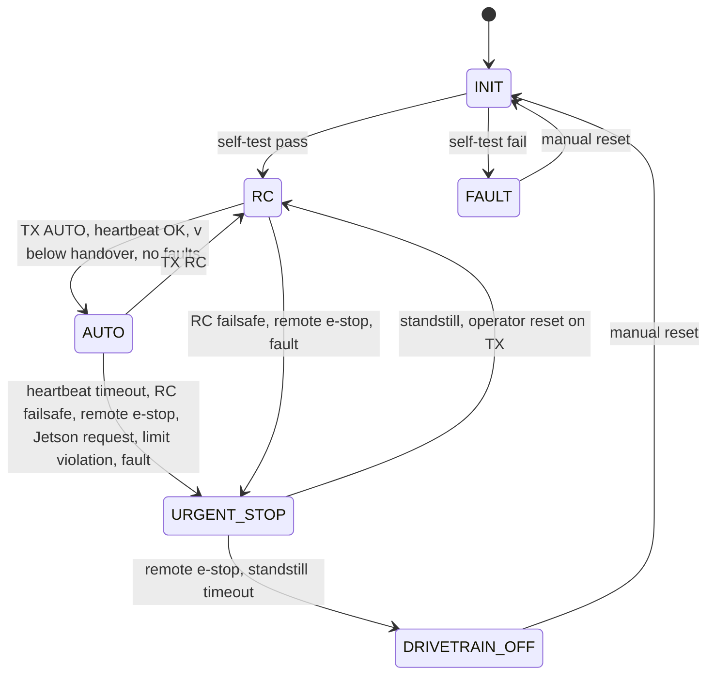

# Safety

2026-09-12: the gateway core in `firmware/gateway` implements sections 2 to 4 and its host tests cover the software items of section 7. Three details were decided in code: the heartbeat accepts a counter advance of 1 to 5 over the last accepted frame (a single lost or corrupted frame is dropped, a frozen or replayed counter is rejected, 50 ms without an accepted frame is still the timeout); re-entering `AUTO` after any exit requires the transmitter switch to pass through `RC`, so a switch left in `AUTO` cannot re-arm the kart; and on remote e-stop the contactor output opens immediately (the e-stop relay is in the contactor circuit anyway) while the brake ramp runs, with the transition to `DRIVETRAIN_OFF` at standstill. On the Jetson side, the controller raises `request_urgent_stop` for stale inputs only while the gateway reports `AUTO`: in `RC` the Jetson has no authority, and a request during startup would brake a human's drive out of the pit.

The kart weighs at least 125 kg, reaches 12 m/s in a few seconds, and is driven by software written by students on a semester schedule. The design assumption is that the Jetson software is wrong until proven otherwise, and that being wrong must end in a stop, not a crash.

## 1. Principles

1. The gateway owns the actuators. The Jetson never has a direct electrical path to steering, throttle, brake or the contactor.
2. Three independent ways to stop, each usable without the others: software urgent stop through the gateway, remote e-stop through a physical controller, physical e-stop that cuts all power.
3. Every link has a failsafe: heartbeat loss, RC link loss, remote e-stop link loss and gateway fault all resolve to the same urgent stop.
4. Limits exist twice: in the Jetson software, where they can be tuned, and in gateway firmware, where they cannot be tuned from the Jetson.
5. Nothing runs autonomously on track until it has run on the bench rig with every fault injected.

## 2. Gateway state machine

Behavior in each state:

| State | Throttle | Brake | Steering | Contactor |
| --- | --- | --- | --- | --- |
| `INIT` | 0 | Held | Disabled | Open |
| `RC` | From TX, ramped, capped | From TX | From TX, rate-limited | Closed |
| `AUTO` | From Jetson, within limits | From Jetson, within limits | From Jetson, within limits | Closed |
| `URGENT_STOP` | 0 | Ramped to full within 300 ms | Held at last angle above 3 m/s, released to TX below | Closed until standstill or e-stop |
| `DRIVETRAIN_OFF` | 0 | Full | Released | Open |
| `FAULT` | 0 | Full | Disabled | Open |

The gateway enters `AUTO` only from `RC`, only while the Jetson heartbeat has been continuous for at least one second, and only below a handover speed (3 m/s at first). A human with a thumb on the transmitter switch is the last layer, and the switch position is polled every cycle.

## 3. Heartbeat and command checks

The Jetson sends `VehicleCommand` at 100 Hz with an incrementing 16-bit counter. The gateway rejects a frame whose counter does not increment by exactly one (after a resync window at enable), whose CRC fails, or whose fields are out of range. If 50 ms pass without an accepted frame the gateway enters `URGENT_STOP`. The gateway echoes the last accepted counter in `VehicleState` so the Jetson can detect that it is being ignored.

Per-frame limits in firmware, all parameters flashed with the firmware and readable but not writable from the Jetson:

| Quantity | Limit |
| --- | --- |
| Steering angle | Mechanical range minus margin |
| Steering rate | Actuator rating; initial value 180 deg/s at the wheels |
| Throttle ramp | Maximum increase per tick |
| Speed cap | Wheel speed above the cap cuts throttle; above cap plus margin triggers `URGENT_STOP` |
| Drivetrain power | Above 15 kW cuts throttle (rule compliance, logged) |
| Brake and throttle together | Throttle forced to 0 when brake command exceeds a threshold |

## 4. Urgent stop sequence

1. Throttle command forced to zero immediately.
2. Brake command ramped to full over 300 ms (a step at speed locks the rears and removes steering authority; the ramp is tuned on the bench and then on track).
3. Steering holds the last angle while speed is above 3 m/s, then follows the transmitter so the operator can steer a rolling kart off the racing line.
4. At standstill the gateway waits for an operator reset from the transmitter before returning to `RC`. If the stop was caused by the remote e-stop, or no reset arrives within the timeout, the contactor opens (`DRIVETRAIN_OFF`).

Stopping distance from 12 m/s on the AKS-specified slicks should be under 15 m; measure it during drive-by-wire characterization and record it in the kart's parameter file.

## 5. Jetson-side checks

These run in `mcq_control` before every command and in `mcq_track` every cycle. Each failure sets `request_urgent_stop` in `VehicleCommand` and a reason code in telemetry.

| Check | Trigger |
| --- | --- |
| Geofence | Ego position outside the inflated track polygon |
| Pose trust | Position covariance above threshold, or GNSS not fixed for longer than the dead-reckoning budget |
| Trajectory age | Newest `Trajectory` older than 200 ms |
| Trajectory validity | Any NaN, any point outside the boundaries, any speed above the cap |
| Command validity | Any NaN or out-of-range field after limiting |
| Gateway agreement | Gateway mode differs from expected for more than 3 ticks, or the heartbeat echo lags by more than 5 |
| Perception disagreement (`FOLLOW` mode) | Perceived boundary differs from the survey by more than the large threshold for more than 1 s |

## 6. Mapping to AKS safety rules

| Rule (Safety and Software sections, December 2025) | Implementation | Verification |
| --- | --- | --- |
| Urgent stop commandable through software | `mcq/urgent_stop` service and `request_urgent_stop` field, both resolved in the gateway | Bench and track fault injection |
| Urgent stop triggers if the controller leaves range or disconnects | ELRS failsafe channel state read by the gateway | Power off the transmitter during a bench run and during a low-speed track run |
| Remote e-stop tied to a physical controller, initiates urgent stop and disconnects drivetrain power | Wireless e-stop relay in the contactor circuit and read by the gateway | Trigger at 200 m line of sight |
| Physical push-button e-stop cutting all power | Mushroom switch disconnecting both battery systems | Inspection |
| Complete remote control from the pit: safety triggers, RC driving, mode switching | ELRS transmitter through the gateway | Drive a full lap under RC from the pit |
| Remote reset without entering the track | Jetson and gateway accept restart commands over the telemetry link; gateway resets from the transmitter | Restart the software mid-session from the pit |
| RCS black box interface: report power, health, mode, speed; obey allowed control mode | `mcq_telemetry`; allowed mode is enforced by the gateway as an additional condition for `AUTO` | Once the AKS library is published |
| Bumpers, covers, no sharp edges, two extinguishers rated for the battery chemistry | Mechanical and pit checklist | Inspection |

## 7. Fault injection list

Every item is run on the bench rig before the first autonomous drive and again after any gateway firmware change. Items marked track are repeated on track at low speed.

1. Unplug the Jetson CAN cable in `AUTO` (track).
2. Kill Jetson power in `AUTO` (track).
3. Freeze the heartbeat counter while continuing to send frames.
4. Send a steering command beyond the angle limit; beyond the rate limit.
5. Send NaN in every field.
6. Send throttle and full brake together.
7. Exceed the speed cap in simulation; exceed cap plus margin.
8. Power off the RC transmitter in `RC` and in `AUTO` (track).
9. Trigger the remote e-stop in `AUTO` (track).
10. Trigger the physical e-stop at standstill.
11. Flip to `AUTO` above the handover speed (must be refused).
12. Flip to `AUTO` with a stale heartbeat (must be refused).
13. Corrupt the CRC of every tenth frame.
14. Publish a trajectory that leaves the boundaries; a trajectory older than 200 ms; a trajectory with speed above the cap.
15. Move the surveyed track file by 2 m and drive `FOLLOW` mode in simulation (geofence must fire). The graph regression uses an explicit 2 m wide synthetic oval, starts driving on its unshifted map, then reloads a copy shifted 2 m through `mcq/load_track`. The normal 5 m wide oval plus 0.5 m inflation still contains a centered kart after a 2 m shift, so that geometry cannot by itself establish this violation. `geofence_graph.sh shift` checks the changed model, outside-polygon verdict, urgent-stop command, gateway stop and standstill. Its `covariance` scenario keeps the pose inside and raises the principal planar variance above the gate.

## 8. Operating rules

Nobody on the track while a kart is powered. The RC operator holds the transmitter with a thumb on the mode switch for the entire autonomous run and is the only person who talks to the person at the laptop. Speed caps are raised in steps (3, 5, 7, 10, 12 m/s) and each step requires five clean laps at the previous one. Two fire extinguishers rated for the battery chemistry are at the pit wall. Every run is logged; a run without a log did not happen.
