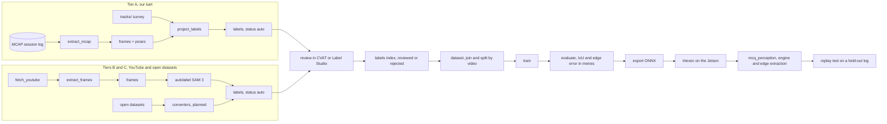

# Training pipeline: from footage to an engine on the kart

How the perception model gets its data, its labels, its training runs and its place in `mcq_perception`. The source survey and the legal position are in [08-training-data.md](08-training-data.md); this document is the pipeline that turns those sources into a model, and the code is in `training/mcq_training/` with a stage-by-stage command list in [training/README.md](../training/README.md). Written 2026-09-13 against the code as it exists on that date; every stage listed as existing has a test that runs in CI without footage, on the synthetic oval.

## 1. The pipeline in one picture

| Stage | Tool | Input | Output | Runs on | Status |
| --- | --- | --- | --- | --- | --- |
| Tier A frames | `extract_mcap.py` | session MCAP: camera topic, `/ego_state` | `data/frames/kart_<session>/…/*.jpg`, `poses.csv`, index rows | laptop | exists, tested against a synthetic log |
| Tier A labels | `project_labels.py` | frames, poses, `tracks/<id>`, camera yaml | label PNGs, index rows, previews | laptop | exists, tested on the oval |
| Tier B and C frames | `data/fetch_youtube.py`, `data/extract_frames.py` | `data/sources.yaml` | raw video, frames at 2 fps, index | laptop with disk | exists (see 08) |
| Tier B and C labels | `autolabel.py` | frames, `configs/autolabel.yaml` | label PNGs, index rows | GPU workstation | exists; SAM 3 backend untested until the weights are on a team machine |
| Open dataset converters | per dataset | their masks and boxes | our label PNGs and index rows | laptop | planned |
| Review | CVAT or Label Studio | auto labels | `status` column in `labels/index.csv` | anyone | tool choice open; the index contract exists |
| Dataset | `dataset.py` | both index files, a recipe yaml | `data/datasets/<name>/` splits and manifest | laptop | exists, tested |
| Train | `train.py` | splits, frames, labels, `configs/seg_*.yaml` | `runs/<name>/best.pt`, metrics | GPU | exists, CPU smoke test in CI |
| Evaluate | `evaluate.py` | checkpoint, held-out split, camera | IoU per class and tier, edge error by range, gates | any | exists, tested |
| Export | `export.py` | checkpoint | `model.onnx` + sidecar json, parity check | any | exists, tested |
| Engine | `trtexec` | ONNX | `model.engine` | the Jetson | JetPack 7.2 ships TensorRT 10.16; engines are built on the kart and are not portable |
| Node | `mcq_perception` | engine, camera_info, image | `TrackBounds`, `Detections` | the Jetson | planned (Phase 4); `boundary.py` is the reference for its post-processing |
| Replay test | `mcq_perception` against a held-out log | MCAP, survey | pass or fail on the same edge metric | CI once logs exist | planned |

## 2. What the model is

A per-pixel classifier over three classes on the rectified forward image, resized to 640 x 400: background (0), pavement (1), kart (2), with 255 as the ignore value in labels. The class list lives in one place, `labels.py`, and every stage imports it.

The consumer is `mcq_perception` (02-architecture.md section 10): argmax, then the edge extraction along image rows in `boundary.py` (leftmost and rightmost pavement pixel of the main pavement blob per row, from the bottom of the image to the horizon), then inverse perspective mapping through the camera model onto the ground plane, then `TrackBounds` in `base_link`. The kart class feeds `Detections`. `BOUNDARY` mode in the planner runs on nothing else, and `FOLLOW` mode uses the same output as a check on the map.

Why segmentation and not an edge regressor: the rulebook defines the track as the paved surface, so the edge is where asphalt stops, with no markings to detect. A pavement mask is the direct statement of that, it degrades gracefully (a bad frame loses a few rows of edge, not the whole edge), and it is what every relevant open dataset provides (RoRaTrack, the Roboflow racetrack set, drivable-area sets).

Acceptance, restated from 08 section 7 and encoded as `eval.gates` in `configs/seg_small.yaml`: pavement IoU at or above 0.95 on held-out tier A laps in daylight, mean absolute edge error at or below 0.3 m in the 10 to 15 m range bin after inverse perspective mapping, and 20 fps or better on the Orin in FP16. The first two are computed by `evaluate.py`; the third by `trtexec` on the kart.

## 3. Getting the data

### 3.1 Tier A: our kart, labels for free

Every session already records every topic to MCAP (02-architecture.md section 13). Once the camera is mounted and calibrated, each session is also a labeled dataset:

1. `extract_mcap.py` reads the compressed image topic and `/ego_state`, keeps one frame every 200 ms (5 fps; pose changes make consecutive frames different, so no perceptual-hash dedupe is needed), interpolates the pose at the image timestamp, and skips frames without a bracketing pose within 50 ms, below 0.5 m/s, or without an RTK fix. The pose that labeled a frame is stored next to it in `poses.csv`.
2. `project_labels.py` moves the surveyed edges into `base_link` with that pose, clips them at the camera's near plane, projects them with the pinhole model and rasterizes the pavement between them. For a closed track the pavement is the exclusive-or of the two projected edge rings, which is exact because the ground plane maps to the image by a homography. An ignore band covers 0.15 m either side of each edge, widened by the distance times tan(0.5 deg) so heading error does not turn into wrong labels far away, and a static mask hides the kart's own bodywork.

A 20 minute practice session at 5 fps is about 6,000 labeled frames. The sessions that matter for diversity are the ones nobody would plan for perception: the Phase 1 parking-lot loop, the Phase 2 laps at 5 m/s, wet days, low sun, an evening session, the survey drives themselves. Mount and calibrate the camera in Phase 1 rather than Phase 4, and every session from then on feeds the model at no cost to the people running it.

What tier A depends on, in order of how often it will bite: the camera model (`configs/camera_default.yaml` is a placeholder; the calibrated intrinsics and the `camera_front` transform from the URDF replace it in the same change), image timestamps at exposure rather than at arrival (`--time-offset` absorbs a constant latency; a variable one shows up as edge error growing with speed), a current survey (a resurfaced or re-coned track invalidates the labels of every session after the change, so the track id and survey date travel with each label row), and RTK fixed (float solutions are skipped by default).

Other karts on the track are not in the survey. The projection labels them as pavement, which is wrong exactly where it matters. The plan is a second pass of `autolabel.py` with only the kart prompts over tier A frames, merged on top of the projected labels; until that pass exists, sessions with other karts on track are labeled with the kart class only after review.

### 3.2 Tiers B and C: footage we did not shoot

`fetch_youtube.py` and `extract_frames.py` exist and are described in 08 section 3; `--dry-run` measures what each source is worth before any disk is spent. From there:

1. `autolabel.py` runs SAM 3 (Meta, November 2025: text-prompted concept segmentation that returns every instance of "asphalt race track surface" or "go-kart" in an image with a score; SAM 3.1 of March 2026 made multi-object video tracking several times faster without changing the model). Prompts, the score threshold and the paint order are in `configs/autolabel.yaml`. Classes are painted in order so a kart mask overrides the pavement under it. A frame with no pavement mask above threshold is written with `status=auto_empty` and stays out of every dataset until someone looks at it. The backend is a small class; a different model (Grounded SAM 2, or SAM 3's video predictor tracking one prompt through a clip, which is cheaper than per-frame prompting once the frame count is large) is a second class behind the same call.
2. Review. The reviewer's job is to accept or reject, not to draw. The contract is the `status` column of `data/labels/index.csv`: `auto` from the tools, `reviewed` or `rejected` from the review export, and the join in `dataset.py` lets a reviewed row beat an auto row for the same frame and drops rejected frames. Which of CVAT and Label Studio is used is an open choice; the export script that writes the index rows is written once the tool is picked. Budget for the first pass: a few thousand frames at a few hundred per reviewer hour.

Open datasets enter through converters, one short script each, that write our PNG labels and index rows with the dataset's license in the row. RoRaTrack first (same task, same state), then the Roboflow racetrack set and the drivable-area set; `spawn99/karting` and the AKS `GoKartSampleSet` are boxes, not masks, so they feed the kart class through the same ignore convention (kart box painted, everything else ignore). None of these exist yet.

SAM 3 practicalities: the package installs from `github.com/facebookresearch/sam3` (Python 3.12, PyTorch 2.7, CUDA 12.6 or newer), the weights are gated on `huggingface.co/facebook/sam3` behind a per-person access request, and the license is Meta's SAM License, which someone reads before the first non-research use. Per-frame prompting of a 850 M parameter model costs a few frames per second on a data-center GPU, so a 100 h tier C pool at 2 fps is a multi-day job on one GPU or an afternoon on a cluster; the video predictor is the cheaper path for long clips.

### 3.3 Synthetic

A rendered Purdue track from the scan (08 section 6) plugs in as another source writing frames and labels with `license=synthetic`; nothing downstream changes. Phase 4.

## 4. Labels

| Value | Class | Notes |
| --- | --- | --- |
| 0 | background | Grass, curbs, barriers, sky, people, pit equipment, the far side of a fence |
| 1 | pavement | The asphalt the kart may drive on: track, painted lines on it, patched pavement. Paved runoff and pit lane count as pavement; the map, not the model, decides whether the kart may go there |
| 2 | kart | Another kart on the track, at any distance |
| 255 | ignore | Not counted by the loss or the metrics: the edge band in projected labels, the kart's own bodywork, review strike-outs, padding from augmentation |

Labels are single-channel PNGs mirroring the frame layout under `data/labels/`. `data/labels/index.csv` records, per label: the frame, the label path, source, video id, method (`projection`, `sam3`, `manual`, a converter name), status, reviewer, date and a note (the projection stores its band and the track id; SAM 3 stores its best score per class). Pixels stay on the team's shared storage; the index and the configs are what git sees.

## 5. Dataset assembly

`dataset.py` joins the frame index with the label index, assigns a tier to each frame (explicit source or video patterns in the recipe first, then the license: `own` is A, Creative Commons or granted permission is B, everything else C), gives each tier a sampling weight, and splits by video so no clip has frames on both sides of train and val. Test is listed explicitly and is meant to be whole tier A sessions at the Purdue track that never enter training; `val` patterns can pin sessions the same way. A stable hash of the video id decides the rest, so a rebuild with new footage keeps existing videos where they were.

The output directory carries `train.csv`, `val.csv`, `test.csv` and `manifest.json` with counts per tier and status, the SHA-256 of each split and the git hash. Recipes are named `seg_v<N>` and live in `training/configs/`; a run copies the manifest into its directory so a checkpoint names its data.

## 6. Training

`train.py` is plain PyTorch on purpose: cross-entropy with the ignore index and per-class weights, AdamW, polynomial decay, mixed precision on a GPU, a tier-weighted sampler, validation IoU every epoch, `best.pt` by the metric named in the config (pavement IoU by default) and `last.pt` always. The run directory holds the config, the dataset manifest, `metrics.json` with the full history and the git hash. There is no experiment tracker to stand up; a table of run directories is the tracker until that stops being enough.

Models are entries in `models.py` with one contract (normalized image in, logits at input size out). The first model is torchvision's LR-ASPP on MobileNetV3-Large with an ImageNet backbone: about 3 M parameters, exports cleanly, and runs well above the 20 fps floor on the Orin in FP16. PIDNet-S and DDRNet-23-slim (MIT, real-time Cityscapes networks with sharper edges) are the next candidates behind the same contract; YOLO-style segmentation heads are not, because of their license, and transformer heads are not, because attention at 640 x 400 is what the DLA is worst at.

Recipe:

1. Pretrain on tiers C and B with auto labels (`configs/seg_small.yaml`, 40 epochs). Diversity is the point of this stage, not label precision.
2. Fine-tune from that checkpoint (`--init`) on tier A plus reviewed tier B at a lower learning rate for 10 to 20 epochs, with tier A weighted highest.
3. Evaluate on held-out tier A only. Until tier A exists, evaluate on held-out tier B with the caveat in 08 section 7.

Augmentation (`data.py`) is scale, vertical and horizontal shift, horizontal flip, brightness, contrast, saturation, blur and occasional grayscale. The vertical shift is the important one: helmet footage sits higher and moves; shifting the horizon at training time is what lets it teach a chassis-mounted camera. Vertical flips and rotations are not used, since the ground is always down.

Compute: one workstation GPU trains the first model in an evening; Purdue's RCAC GPU nodes are the option for the SAM 3 labeling pass and for sweeps. Nothing here runs on the Jetson except the exported engine.

## 7. Evaluation

`evaluate.py` reports IoU per class overall and per tier, and for frames whose camera is known (tier A) the edge error in metres: both the prediction and the label go through the same `boundary.py` extraction and inverse perspective mapping, and the lateral distance between the two edges is binned by range (0 to 5, 5 to 10, 10 to 15, 15 to 20, 20 to 30 m). Rows where the label has an edge and the prediction has no pavement count as misses. Because the extractor is the same code the node will port, the number is the model's error on the ground and not an artifact of the metric. The gates from section 2 are checked on the tier A subset and the result is written next to the checkpoint.

What is not built yet: slices by condition (light, wet, other karts present) from a session tag in the index, and a worst-frames listing for review. Both are small additions once real logs give them something to show.

## 8. Export and the kart

`export.py` writes a fixed-shape ONNX graph (1 x 3 x 400 x 640, opset 18, through the `torch.export` based exporter that is the default since PyTorch 2.9) and a sidecar json with the input size, the normalization constants, the class order and the git hash; then it runs the graph in onnxruntime against PyTorch on random input and records the parity. On the Jetson, `trtexec --onnx=model.onnx --saveEngine=model.engine --fp16` builds the engine for TensorRT 10.16 (JetPack 7.2); INT8 with calibration frames from tier A is a later step if FP16 does not fit the 40 ms budget. Engines are tied to the TensorRT version and the GPU, so they are built on the kart and named after the checkpoint and the git hash, never committed.

`mcq_perception` applies the sidecar's normalization, runs the engine, takes the argmax, extracts edges as `boundary.py` does, maps them to the ground with the calibrated camera and publishes `TrackBounds` with per-point confidence (0 where the pavement touches the image border, 1 otherwise). The replay test for a new engine is the node run against a held-out session log with the survey as truth and the same edge metric as `evaluate.py`; it becomes a CI job the day the first log exists, and no engine goes on the kart without it.

## 9. The other two learned components

02-architecture.md section 11 lists two more: a dynamics residual (commanded versus measured acceleration from logged laps, a lookup table or a small MLP inside the speed profiler and the MPC model) and a trajectory policy trained in `mcq_sim`. Both follow the same shape as this pipeline: `extract_mcap.py` grows a mode that pulls `VehicleCommand`, `VehicleState` and `EgoState` into a table; a run directory with a config, a manifest and metrics; a gate before anything reaches the kart (reduced prediction error on held-out laps; the simulator test suite the classical planner passes). Neither is started, and neither should be before Phase 3 has logs.

## 10. Order of work

| When | Do | Owner |
| --- | --- | --- |
| Now | `fetch_youtube.py --dry-run` to measure the sources; request SAM 3 access for two people; pick the review tool | perception |
| Phase 1 | Mount and calibrate the camera with the sensors; camera yaml and URDF transform; check exposure timestamps; first tier A frames from the parking-lot loop | hardware, perception |
| Phase 1 to 2 | RoRaTrack converter; first SAM 3 pass on the chassis-cam sources; first reviewed 3,000 frames; `seg_v1` recipe and first pretraining run | perception |
| Phase 3 | Tier A from every Purdue session; fine-tune; evaluate on held-out sessions | perception |
| Phase 4 | Export, engine, `mcq_perception`, replay test, `BOUNDARY` mode | perception, planning |

Open decisions: the review tool; whether the camera is GMSL2 or USB3, which decides where rectification happens; how session tags (light, weather, traffic) are recorded so evaluation can slice by them (the session README next to each log is the obvious place, read by `extract_mcap.py`).
